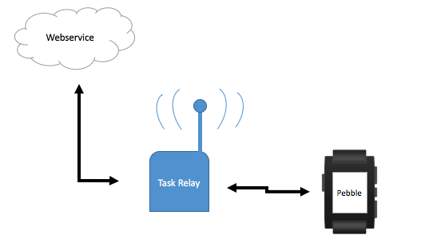

***Only works with Python 3.x***
```
pip3 install -r /path/to/requirements.txt
```
Run *Bootstrapper.py* to start Task Relay 


The route in the following flowchart is based on an exchange of messages without any errors.


This image shows the different task relay commands

